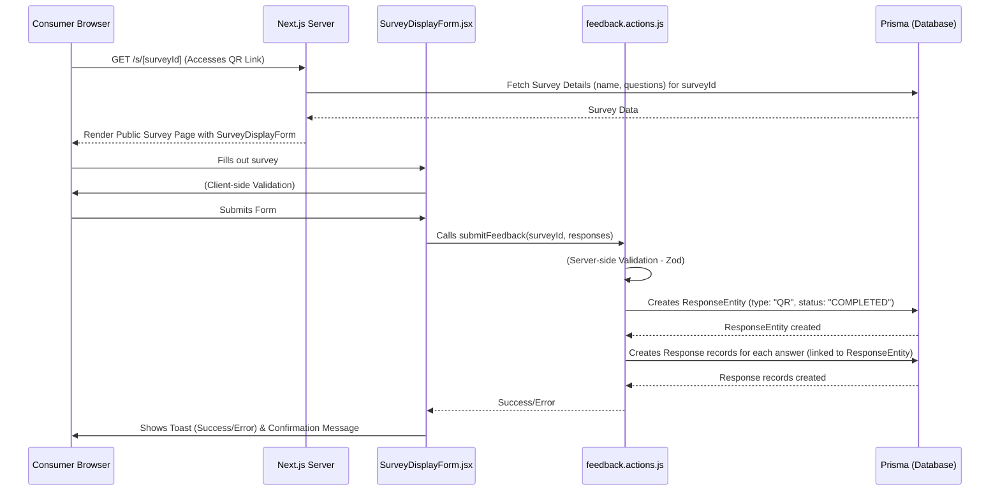

# Phase 4: Core Feedback Submission & Viewing (Consumer & BO) - Detailed Plan

**Overall Goal:** Enable consumers to submit feedback via a public QR code-linked survey page and allow Business Owners (BOs) to view this submitted feedback in a read-only format within their dashboard.

**User Stories Addressed (from [`instructions/documents/FeedbackPro_PRD.md`](instructions/documents/FeedbackPro_PRD.md)):**

- `CUST-SURV-01`: As a Consumer, I want to easily access a survey form via a link (from SMS) or QR code scan. (Focus on QR for this phase)
- `CUST-SURV-02`: As a Consumer, I want the survey form to load quickly and be easy to use on my mobile device, without requiring login.
- `CUST-SURV-03`: As a Consumer, I want to answer the questions easily (tapping/typing).
- `CUST-SURV-04`: As a Consumer, I want clear confirmation after submitting my feedback.
- `BO-ANAL-01`: As a BO, I want to view individual survey responses (both SMS and QR), knowing this data is read-only for me, ensuring its integrity. (Focus on QR responses for this phase)

**Data Flow Diagram (Mermaid):**



---

### Detailed Tasks:

#### 1. Create Public Survey Page for Consumers

- **File:** `app/(public)/s/[surveyId]/page.jsx`
- **Objective:** Display a specific survey to a consumer for feedback submission.
- **Implementation Details:**
  - This will be a Next.js Server Component by default.
  - **Data Fetching:**
    - Accept `params.surveyId` from the URL.
    - Fetch survey details (name, description, questions with their `id`, `text`, `type`, `isRequired`, `order`) from the database using Prisma.
      - Ensure only `ACTIVE` surveys are fetched. If not found or not active, consider redirecting to a "not found" page or showing an appropriate message (though full error page development is deferred).
      - Example Prisma query structure:
        ```javascript
        // In app/(public)/s/[surveyId]/page.jsx
        // const survey = await prisma.survey.findUnique({
        //   where: { id: surveyId, status: 'ACTIVE' },
        //   select: {
        //     id: true,
        //     name: true,
        //     description: true,
        //     questions: {
        //       orderBy: { order: 'asc' },
        //       select: { id: true, text: true, type: true, isRequired: true, order: true }
        //     }
        //   }
        // });
        ```
  - **UI Rendering:**
    - Display the survey `name` and `description`.
    - Pass the fetched `survey.questions` array as a prop to the `SurveyDisplayForm` client component.
    - Structure the page for clarity and mobile-friendliness (Tailwind CSS).
    - Ensure this page does not require authentication.
- **Best Practices:**
  - **Performance:** Fetch only necessary data. Leverage RSCs for static content.
  - **UX:** Clear presentation of survey title and description.

#### 2. Develop Survey Display Form Component

- **File:** `components/features/feedback/survey-display-form.jsx`
- **Objective:** Render the survey questions dynamically and handle user input and submission.
- **Implementation Details:**
  - Mark as a client component: `"use client";`
  - **Props:**
    - `surveyId: string`
    - `questions: Array<{id: string, text: string, type: QuestionType, isRequired: boolean}>`
  - **Form Handling (React Hook Form & Zod):**
    - Initialize `useForm` from `react-hook-form`.
    - Generate Zod schema dynamically based on the `questions` prop to validate inputs. Each question's answer should be validated based on its `isRequired` status and `type`.
      - For `RATING_SCALE_5` and `YES_NO`, ensure a value is selected if `isRequired`.
      - For `TEXT`, ensure text is provided if `isRequired`.
    - Integrate Zod schema with React Hook Form using `@hookform/resolvers/zod`.
  - **Dynamic Question Rendering:**
    - Iterate over the `questions` prop.
    - For each question, render appropriate input fields using Shadcn UI components:
      - `QuestionType.TEXT`: Use [`<Textarea>`](components/ui/textarea.jsx) or [`<Input>`](components/ui/input.jsx).
      - `QuestionType.RATING_SCALE_5`: Use [`<RadioGroup>`](components/ui/radio-group.jsx) with 5 options (e.g., labels "1" to "5").
      - `QuestionType.YES_NO`: Use [`<RadioGroup>`](components/ui/radio-group.jsx) with "Yes" and "No" options.
      - Display question `text` clearly. Mark required fields visually (e.g., with an asterisk).
    - Register each input field with React Hook Form (`register`).
    - Display validation errors from React Hook Form.
  - **Submission Logic:**
    - On form submit (`handleSubmit` from React Hook Form):
      - Call the `submitFeedback` server action (see Task 3).
      - Pass `surveyId` and the formatted response data. Response data should be an array of objects, e.g., `[{ questionId: '...', value: '...' }, ...]`.
      - Manage loading state (e.g., disable submit button, show spinner).
      - Use the [`useToast`](hooks/use-toast.js) hook to display success or error messages returned from the server action.
      - On successful submission, display a clear confirmation message to the user (e.g., "Thank you for your feedback!"). Consider hiding the form and showing this message.
- **Best Practices:**
  - **Modularity:** This component should be self-contained for displaying and submitting any survey.
  - **UX:** Intuitive form layout, clear error messaging, immediate feedback on submission. Mobile-first design.
  - **Accessibility:** Ensure form elements are accessible (labels, ARIA attributes if necessary).

#### 3. Implement Feedback Submission Server Action

- **File:** `lib/actions/feedback.actions.js`
- **Function:** `async function submitFeedback(surveyId, responsesData)` (create or update this file/function)
- **Objective:** Validate and store the submitted feedback in the database.
- **Implementation Details:**
  - **Input Parameters:**
    - `surveyId: string`
    - `responsesData: Array<{ questionId: string, value: string }>`
  - **Validation (Zod):**
    - Define a Zod schema to validate `surveyId` (e.g., CUID) and `responsesData` (array of objects with specific string formats for `questionId` and `value`).
    - Parse and validate the input. If validation fails, return an error object (e.g., `{ success: false, error: "Invalid input." }`).
  - **Database Operations (Prisma):**
    - Use `prisma.$transaction` to ensure atomicity for creating related records.
    - Inside the transaction:
      1.  **Create `ResponseEntity`:**
          - `type`: "QR"
          - `status`: "COMPLETED" (as feedback is submitted immediately)
          - `surveyId`: the validated `surveyId`
          - Example:
            ```javascript
            // const responseEntity = await tx.responseEntity.create({
            //   data: {
            //     surveyId: validatedSurveyId,
            //     type: 'QR',
            //     status: 'COMPLETED',
            //   }
            // });
            ```
      2.  **Create `Response` records:**
          - Iterate through the `validatedResponsesData`.
          - For each item, create a `Response` record:
            - `value`: `item.value`
            - `questionId`: `item.questionId`
            - `responseEntityId`: `responseEntity.id` (from the `ResponseEntity` created above)
          - Example (inside loop):
            ```javascript
            // await tx.response.create({
            //   data: {
            //     value: item.value,
            //     questionId: item.questionId,
            //     responseEntityId: responseEntity.id,
            //   }
            // });
            ```
  - **Return Value:**
    - On success: `return { success: true, message: "Feedback submitted successfully." };`
    - On error (validation or database): `return { success: false, error: "Failed to submit feedback." };` (Log detailed errors server-side).
- **Best Practices:**
  - **Security:** Robust server-side validation is critical.
  - **Data Integrity:** Transactions ensure that feedback is either fully saved or not at all.
  - **Error Handling:** Provide clear, user-friendly error messages back to the client while logging specifics on the server.
  - **Immutability:** This action creates new records, aligning with the "feedback immutability" requirement.

#### 4. Update BO Survey Details Page to Display Feedback

- **File:** `app/(bo)/surveys/[surveyId]/page.jsx` (and potentially new child components)
- **Objective:** Allow Business Owners to view submitted feedback for their surveys in a read-only format.
- **Implementation Details:**
  - **Data Fetching (Server Component - `page.jsx`):**
    - Use the `auth()` helper from [`@/lib/auth`](lib/auth.js) to ensure the user is an authenticated and active BO.
    - Fetch the survey details as already implemented in Phase 3.
    - Additionally, fetch associated `ResponseEntity` records for the current `surveyId` where `type === 'QR'`.
    - For each `ResponseEntity`, include its related `Response` records, and for each `Response`, include the `Question` text.
      - Example Prisma query structure:
        ```javascript
        // const surveyResponses = await prisma.responseEntity.findMany({
        //   where: {
        //     surveyId: params.surveyId,
        //     type: 'QR',
        //     // Potentially filter by survey.businessId to ensure BO owns this survey
        //     // survey: { business: { userId: session.user.id } } // This check should already be in place for survey details
        //   },
        //   orderBy: { createdAt: 'desc' },
        //   include: {
        //     responses: {
        //       orderBy: { question: { order: 'asc' } }, // Order responses by question order
        //       include: {
        //         question: { select: { text: true, order: true } } // Fetch question text and order
        //       }
        //     }
        //   }
        // });
        ```
  - **UI Rendering (Client Component - e.g., `components/features/surveys/response-viewer.jsx` or similar):**
    - Create a new client component (e.g., `ResponseViewer.jsx`) to display the fetched `surveyResponses`. This component would be used within the `app/(bo)/surveys/[surveyId]/page.jsx`.
    - Pass the `surveyResponses` data as a prop.
    - **Display Logic:**
      - Iterate through each `ResponseEntity` (each represents one submission).
      - For each submission, display:
        - Submission timestamp (`responseEntity.createdAt`).
        - A list of questions and their corresponding answers (`responseEntity.responses`).
          - Display `response.question.text` and `response.value`.
      - The display must be **read-only** as per PRD `BO-ANAL-01`.
      - Consider UI for handling multiple responses (e.g., cards for each submission, an accordion, or a table).
      - If there are no responses, display an appropriate "No feedback submitted yet" message.
- **Best Practices:**
  - **Readability:** Present feedback in a clear, easy-to-understand format for the BO.
  - **Performance:** Paginate results if a survey can have a very large number of responses (though likely not an MVP V1 concern for QR, more for SMS later).
  - **Security:** Ensure data fetching is scoped to the authenticated BO's business/surveys. This should already be handled by existing `auth()` checks and Prisma query patterns from Phase 3.

---

### General Best Practices for Phase 4:

- **Modularity & Reusability:**
  - The [`components/features/feedback/survey-display-form.jsx`](components/features/feedback/survey-display-form.jsx) should be designed with potential reuse in mind (e.g., for SMS-based feedback later, if the form structure is similar).
  - Utility functions for data transformation or complex Zod schemas can be placed in `lib/utils.js` or more specific files within `lib/`.
- **Scalability & Performance:**
  - Write efficient Prisma queries. Use `select` to fetch only necessary fields.
  - The public survey page (`app/(public)/s/[surveyId]/page.jsx`) must be optimized for fast load times (PRD requirement <2s).
- **Separation of Concerns:**
  - Adhere to the established pattern of Server Actions for mutations and data fetching in Server Components, with Client Components for UI interactivity.
- **Project Structure Consistency:**
  - Place new files in their respective directories as outlined (e.g., `app/(public)/...`, `components/features/feedback/...`, `lib/actions/...`).
- **Tailwind CSS & Shadcn UI:**
  - Utilize existing Shadcn UI components ([`components/ui/`](components/ui/)) for consistency and rapid development.
  - Ensure all new UI is responsive, especially the consumer-facing survey form.
- **UI/UX Design:**
  - **Consumer Form:** Prioritize simplicity, speed, and mobile-friendliness. Provide clear confirmation upon submission.
  - **BO Feedback View:** Ensure data is presented clearly and is explicitly read-only.
- **Clean Code & Maintainability:**
  - Use descriptive names for variables, functions, and components.
  - Add JSDoc comments for new functions and components, especially for complex logic or props.
  - Implement thorough error handling in Server Actions and display user-friendly toasts on the client.
- **Security:**
  - Continue rigorous server-side validation (Zod) for all inputs.
  - Ensure authorization checks prevent unauthorized data access or modification.
  - The feedback immutability principle (BO cannot alter submitted feedback) is upheld by making the BO view read-only and having the submission action create new records.
- **Testing (Manual for MVP):**
  - Thoroughly test the end-to-end flow:
    1.  BO creates a survey (Phase 3 functionality).
    2.  BO gets QR code link (Phase 3 functionality).
    3.  Consumer accesses the link, sees the survey.
    4.  Consumer submits feedback.
    5.  Consumer sees success toast and confirmation.
    6.  Verify `ResponseEntity` and `Response` records are correctly created in the database.
    7.  BO views the survey details and sees the submitted feedback, read-only.

---
